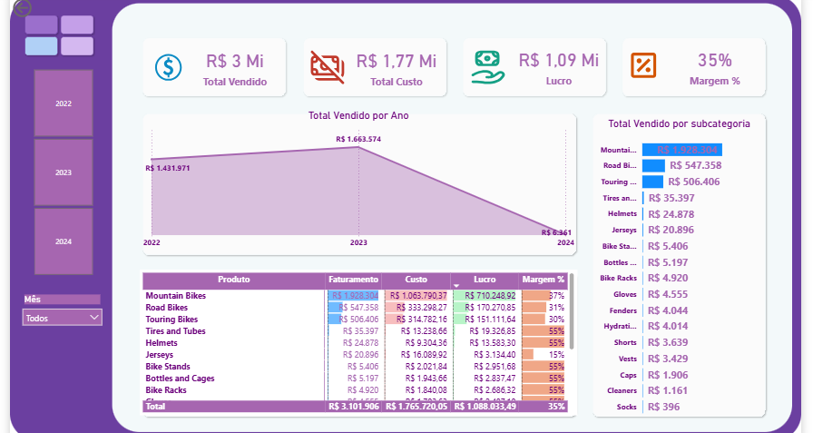

# 📊 Dashboard de Vendas - Power BI

Este projeto foi desenvolvido como parte dos meus estudos em análise de dados, com o objetivo de transformar dados brutos em informações úteis por meio de um dashboard interativo no Power BI.

##  Sobre o projeto

A ideia foi simular um cenário real de análise de vendas, passando por todas as etapas: desde a importação dos dados até a construção de um dashboard com indicadores relevantes para tomada de decisão.

Mais do que apenas criar gráficos, o foco foi entender como estruturar bem os dados para que a análise faça sentido.

---

##  Ferramentas utilizadas

* Power BI
* Power Query
* DAX
* Excel

---

##  Etapas do desenvolvimento

### 1 - Coleta de dados

Os dados foram obtidos a partir de uma planilha Excel.

### 2 - Tratamento de dados

Utilizei o Power Query para limpeza, padronização e organização dos dados, garantindo consistência para análise.

### 3 - Modelagem de dados

Estruturei o modelo utilizando o conceito de:

* **Tabela fato:** fVendas
* **Tabelas dimensão:** dClientes, dProdutos e dCalendario

Essa etapa foi essencial para garantir uma análise mais eficiente e escalável.

### 4 - Criação de métricas (DAX)

Foram desenvolvidas algumas medidas importantes, como:

* Total Vendido
* Total de Custo
* Lucro
* Margem (%)
* Impostos

### 5 - Construção do dashboard

Com os dados tratados e modelados, desenvolvi um dashboard com foco em análise de vendas, incluindo indicadores, gráficos e filtros interativos.

---

## 📸 Preview do dashboard

---

## 🎥 Demonstração

---

##  Principais aprendizados

* A importância do tratamento de dados antes da análise
* Como a modelagem (fato e dimensão) impacta diretamente os resultados
* Criação de métricas com DAX
* Construção de dashboards interativos no Power BI

---

##  Observação

Este projeto foi desenvolvido para fins de estudo e prática em análise de dados.

